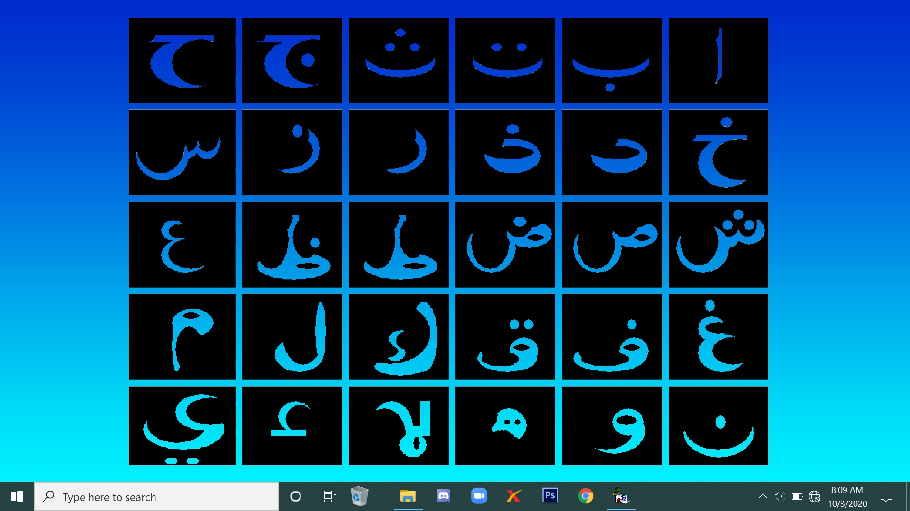
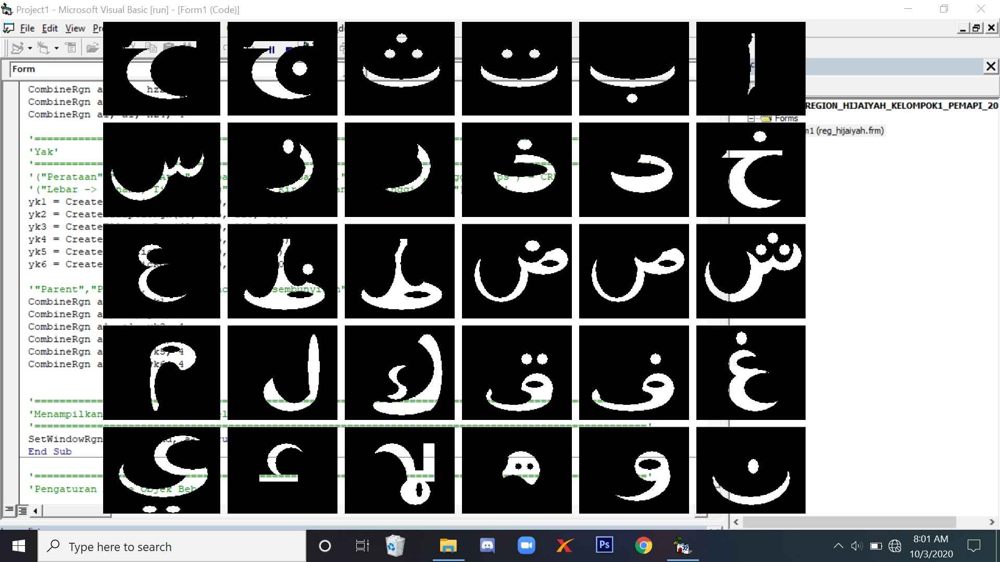

[](https://github.com/ellerbrock/open-source-badges/)
[](https://opensource.org/licenses/MIT)


# Api-Region-Huruf-Hijaiyah
<strong>Tugas Akhir ke-1 dalam Pemrograman API</strong><br><br>
Region Visual Basic 6 untuk membentuk huruf ``` Hijaiyah ```

<br>

## Penjelasan
Dengan menggunakan API Lib ``` gdi32 ``` yang ada pada Visual Basic 6, anda dapat memanipulasi berbagai macam objek sesuai dengan yang diinginkan. Fungsi lib ``` gdi32 ``` dapat diaplikasikan pada form, adapun fungsi yang digunakan pada umumnya yaitu :<br><br>

| Nomor | Nama Fungsi | Deskripsi |
| --- | --- | --- |
| 1 | PathToRegion | Berfungsi untuk membuat area dari jalur yang dipilih menjadi area tertentu. |
| 2 | PtlnRegion | Berfungsi untuk menentukan apakah titik tertentu berada di dalam wilayah yang ditentukan. |
| 3 | OffsetRegion | Berfungsi untuk bergerak di area internal dengan batasan yang telah ditentukan. |
| 4 | CreateRoundRectRgn | Berfungsi untuk membuat bentuk persegi panjang dengan sudut tumpul (bulat). |
| 5 | CreateRectRgnIndirect | Berfungsi untuk membuat area persegi panjang dari struktur RECT. |
| 6 | CreateRectRgn | Berfungsi untuk membentuk objek persegi panjang baru. |
| 7 | CreatePolyPolygonRgn | Berfungsi untuk membuat area yang terdiri dari serangkaian poligon. |
| 8 | CreatePolygonRgn | Berfungsi untuk membentuk objek berbentuk poligon baru. |
| 9 | CreateEllipticRgnIndirect | Berfungsi untuk menciptakan area elips pada struktur RECT. |
| 10 | CreateEllipticRgn | Berfungsi untuk membentuk objek elips atau bulat baru. |
| 11 | CombineRgn | Berfungsi untuk menyambungkan bagian yang berpotongan dari dua area yang berbeda.<br><br><li>&emsp;Angka 2 dalam fungsi Combine adalah fill object, yang berarti<br>&emsp;&emsp;&nbsp;&nbsp;mengisi objek dalam bidang tertentu yang diinginkan.</li><br><li>&emsp;Angka 4 dalam fungsi Combine adalah remove object, yang<br>&emsp;&emsp;&nbsp;&nbsp;berarti menghapus objek di bidang tertentu yang diinginkan. |
| 12 | SetWindowRgn (handle, variabel, True) | Pengendalian formulir atau kontrol lain yang akan diubah atau bentuk tak terkalahkan untuk formulir yaitu Form.hwnd. |
| 13 | Send Message | Berfungsi untuk menampilkan hasil keluaran ke windows. |
| 14 | ReleaseCapture | Berfungsi untuk menyebabkan proses tombol mouse menjadi responsif. |

<br>

## Kebutuhan Proyek
| Bagian | Deskripsi |
| --- | --- |
| Peralatan | Visual Basic 6.0 Enterprise |
| Sistem Operasi | Windows 10 |

<br>

## Unduh & Instal Visual Basic 6.0 Enterprise
<table><tr><td width="840">
  
```
https://bit.ly/VisualBasic6_Installer
```

</td></tr></table>

<br>

## Memulai
1. Unduh repositori ini.<br>
2. Ekstrak file.<br>
3. Klik ``` REGION_HIJAIYAH_KELOMPOK1_PEMAPI_2020.exe ``` untuk menjalankan program aplikasi.<br>
4. Selamat menikmati [Selesai].

<br>

## Sorotan
<table>
<tr>
<th colspan="3">Implementasi</th>
</tr>
<tr>
<td width="280"></td>
<td width="280"></td>
<td width="280"></td>
</tr>
</table>

<br>

## KELOMPOK 1 - API
| NOMOR | NAMA LENGKAP | NPM |
| --- | --- | --- |
| 1 | Heri Khariono | 18081010002 |
| 2 | Devan Cakra Mudra Wijaya | 18081010013 |
| 3 | Chakra Satrya Pradana Putra Arianto | 18081010102 |
| 4 | Ilham Krisdianta Siregar | 18081010103 |

<br>

## Apresiasi
Jika karya ini bermanfaat bagi anda, maka dukunglah karya ini sebagai bentuk apresiasi kepada penulis dengan mengklik tombol ``` ⭐Bintang ``` di bagian atas repositori.

<br>

## LISENSI 
LISENSI MIT - Hak Cipta © 2020 - Devan C. M. Wijaya

Dengan ini diberikan izin tanpa biaya kepada siapa pun yang mendapatkan salinan perangkat lunak ini dan file dokumentasi terkait perangkat lunak untuk menggunakannya tanpa batasan, termasuk namun tidak terbatas pada hak untuk menggunakan, menyalin, memodifikasi, menggabungkan, mempublikasikan, mendistribusikan, mensublisensikan, dan/atau menjual salinan Perangkat Lunak ini, dan mengizinkan orang yang menerima Perangkat Lunak ini untuk dilengkapi dengan persyaratan berikut:

Pemberitahuan hak cipta di atas dan pemberitahuan izin ini harus menyertai semua salinan atau bagian penting dari Perangkat Lunak.

DALAM HAL APAPUN, PENULIS ATAU PEMEGANG HAK CIPTA DI SINI TETAP MEMILIKI HAK KEPEMILIKAN PENUH. PERANGKAT LUNAK INI DISEDIAKAN SEBAGAIMANA ADANYA, TANPA JAMINAN APAPUN, BAIK TERSURAT MAUPUN TERSIRAT, OLEH KARENA ITU JIKA TERJADI KERUSAKAN, KEHILANGAN, ATAU LAINNYA YANG TIMBUL DARI PENGGUNAAN ATAU URUSAN LAIN DALAM PERANGKAT LUNAK INI, PENULIS ATAU PEMEGANG HAK CIPTA TIDAK BERTANGGUNG JAWAB, KARENA PENGGUNAAN PERANGKAT LUNAK INI TIDAK DIPAKSAKAN SAMA SEKALI, SEHINGGA RISIKO ADALAH MILIK ANDA SENDIRI.
